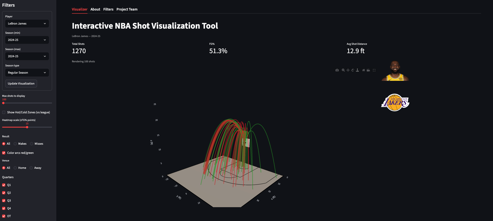

# CourtSpace3D-v4

An interactive Streamlit application for exploring NBA shot patterns through a 3D half-court visualization. The app allows users to select a player, season range, and shot context, then view each shot as a 3D trajectory over a realistic NBA half court. It also includes an optional hot/cold zone heatmap that compares a player's field goal percentage by court region against league average.

> Built as a sports analytics and data visualization project using Python, Streamlit, Plotly, and the `nba_api` package.

## Live App

```text
https://courtspace3d-v4.streamlit.app/
```

## Project Overview

Traditional shot charts are useful, but they are usually flat 2D plots. This project turns NBA shot chart data into an interactive 3D visual tool where users can explore where a player shoots, what types of shots they take, whether those shots were makes or misses, and how their efficiency compares to league average by zone.

The app is designed for:

- Basketball fans who want a more visual way to explore player shot profiles
- Analysts and scouts looking for spatial shooting strengths and weaknesses
- Players, coaches, and trainers interested in development areas
- Students learning how sports analytics, visualization, and interactive web apps can work together

## App Preview




## Key Features

- **Interactive 3D shot arcs**  
  Each shot is rendered as a 3D trajectory from its court location to the rim.

- **Realistic NBA half-court geometry**  
  The court includes a half-court floor, paint, free throw line, restricted area, three-point line, rim, and backboard using NBA-style dimensions.

- **Live NBA shot data**  
  Shot data is loaded through `nba_api` using NBA Stats shot chart endpoints.

- **Player and season selection**  
  Users can choose any available NBA player and select a single season or multi-season range.

- **Regular season and playoff support**  
  The sidebar allows users to switch between Regular Season and Playoffs data.

- **Contextual shot filters**  
  Users can filter by makes/misses, home/away venue, quarter, overtime, shot distance, shot type, and opponent.

- **Shot profile summary metrics**  
  The app reports total shots, field goal percentage, and average shot distance for the current filtered view.

- **Player headshot and team logo display**  
  The app uses NBA CDN image URLs to show the selected player's headshot and team logo or logos.

- **Hot/cold zone heatmap**  
  A league-relative heatmap shows where the selected player shoots better or worse than league average.

- **Hover tooltips**  
  Shot arcs show shot type, distance, and result. Heatmap zones show player FG%, league FG%, and the difference.

## Tech Stack

- **Python**
- **Streamlit** for the web app interface
- **Plotly** for the 3D court, shot arcs, and interactive visualization
- **pandas** for data manipulation
- **NumPy** for geometry and trajectory calculations
- **nba_api** for player, team, shot chart, and league average data

## Data Source

The app uses the `nba_api` package to retrieve shot chart data from NBA Stats.

The main data-loading logic:

- Gets all available NBA players from `nba_api.stats.static.players`
- Gets team metadata from `nba_api.stats.static.teams`
- Loads player shot chart data with `ShotChartDetail`
- Retrieves both player shot attempts and league-average shot zone data
- Adds venue and opponent fields by comparing the player's team abbreviation with the home and away teams in each game

The configured season list currently begins with **1996-97** and runs through **2024-25** based on the season range defined in `data_io.py`. To add future seasons, update the `end` argument in `get_available_seasons()`.

## Repository Structure

The app imports helper modules from a `src` package. A clean GitHub structure should look like this:

```text
.
├── app.py
├── requirements.txt
├── README.md
└── src/
    ├── court_geometry.py
    ├── data_io.py
    ├── filters.py
    ├── heatmap.py
    ├── shots.py
    ├── viz_3d.py
    ├── zone_classify.py
    └── zone_tables.py
```

If the main app file is currently named something like `app(22).py`, rename it to `app.py` before deploying or committing the final portfolio version.

The uploaded project also included `zone_tables - Copy.py`. That file appears to be a duplicate or backup copy of `zone_tables.py`; it is not imported by the app and does not need to be included in the final cleaned repository.

## How the App Works

### 1. User selects a dataset

The sidebar includes a form where the user selects:

- Player
- Minimum season
- Maximum season
- Season type: Regular Season or Playoffs

The player and season form uses an **Update Visualization** button so the app does not repeatedly call the NBA API every time another filter changes.

### 2. Shot data is loaded and cached

When the user submits the form, the app loads the selected shot data through `data_io.py`.

For a single season, the app calls:

```python
load_shotlog(player_name, season, season_type)
```

For multiple seasons, it calls:

```python
load_shotlog_multi(player_name, seasons, season_type)
```

The returned data includes:

- `player_df`: Player-level shot attempts
- `league_df`: League-average shot zone data

The app stores these DataFrames in Streamlit session state so the visualization can update without reloading the full dataset after every sidebar filter change.

### 3. Filters are applied

After data is loaded, the app creates a filter state and applies the selected options through `filter_df()`.

Current filters include:

- Period: Q1, Q2, Q3, Q4, OT
- Result: All, Makes, Misses
- Venue: All, Home, Away
- Opponent
- Shot type
- Shot distance bucket
- Maximum shots to display

### 4. The 3D court is created

The court is generated in `court_geometry.py` using Plotly 3D traces. The figure includes:

- Half-court floor
- Boundary lines
- Paint rectangle
- Free throw arc
- Restricted area
- Three-point line
- Rim
- Backboard

The court geometry is defined in feet to match NBA-style dimensions.

### 5. Shot coordinates are transformed

NBA shot chart coordinates are converted from the NBA API coordinate system into the app's court coordinate system.

The `shots.py` module converts:

- `LOC_X` into lateral court position
- `LOC_Y` into distance from the baseline

The app then draws each shot as a quadratic Bezier curve from the shot location to the rim.

### 6. Shot arcs are rendered

Each shot is drawn as a 3D arc.

By default:

- Makes are green
- Misses are red

When the hot/cold heatmap is enabled, users can choose whether to keep make/miss colors or render all arcs in gray so the heatmap is easier to read.

To improve performance, the app samples the shot data when the filtered set exceeds the selected maximum number of shots.

### 7. Optional hot/cold zone heatmap is added

When the user enables **Show Hot/Cold Zones (vs league)**, the app compares the selected player's field goal percentage to league average by zone.

The heatmap calculation:

1. Aggregates player makes and attempts by shot zone
2. Aggregates league-average FG% by shot zone
3. Computes the difference:

```text
Player FG% - League FG%
```

4. Builds a grid across the half court
5. Classifies each grid cell into a shot zone
6. Colors the floor by the player's efficiency difference

Color interpretation:

- **Red**: Player shoots better than league average from that area
- **Blue**: Player shoots worse than league average from that area
- **White/neutral**: Player is close to league average

The heatmap requires **Result = All** because it needs both makes and misses to calculate field goal percentage fairly.

## Sidebar Controls

| Control | Description |
|---|---|
| Player | Selects the NBA player to visualize |
| Season min / Season max | Selects the season or season range |
| Season type | Switches between Regular Season and Playoffs |
| Max shots to display | Limits the number of rendered shots for performance |
| Show Hot/Cold Zones | Toggles the player vs league heatmap |
| Heatmap scale | Controls the sensitivity of the hot/cold color scale |
| Result | Filters all shots, makes only, or misses only |
| Color arcs red/green | Toggles make/miss shot arc coloring |
| Venue | Filters shots by home or away games |
| Quarters | Includes or excludes Q1, Q2, Q3, Q4, and overtime |
| Shot Distance | Filters shots by distance bucket |
| Shot Type | Filters by NBA `ACTION_TYPE` |
| Opponent | Filters shots against a specific opposing team |


## Known Limitations

- The app depends on NBA Stats data through `nba_api`, so load times and availability may depend on the NBA Stats endpoint.
- The configured season range currently goes through 2024-25. Future seasons require updating the season list in `data_io.py`.
- Older seasons may have less consistent shot-tracking data due to historical changes in NBA data collection.
- Rendering thousands of 3D shot arcs can be computationally heavy, so the app includes a maximum shot display slider and random sampling.
- The clutch shot filter is listed as a future feature but is not currently implemented in the filtering logic.
- The visualization models shot paths as smooth Bezier arcs for interpretability. These are visual approximations, not measured physical ball trajectories.

## Future Improvements

Potential next steps:

- Add a true clutch-time filter using score margin and game clock data
- Add side-by-side player comparison
- Add season-over-season player development views
- Add export options for filtered shot data or chart images
- Add automated tests for coordinate conversion and zone classification
- Add a project screenshot or short demo GIF to the README
- Update the season range automatically as new NBA seasons become available

## Project Team

This project was created by **Arvind Madan** and **Daniel Fulk** for a UNC **Visualizations & Communication** course. The project combines sports analytics, interactive visualization, and basketball domain knowledge to make NBA shot data more engaging and easier to explore.

- [Arvind Madan on LinkedIn](https://www.linkedin.com/in/arvind-aditya-madan-08271174/)
- [Daniel Fulk on LinkedIn](https://www.linkedin.com/in/daniel-fulk-80a88a240/)

## Acknowledgments

This project was inspired in part by modern basketball shot chart work, including the visual style popularized by Kirk Goldsberry. The goal was to build an interactive tool that lets fans, students, and analysts explore player shooting patterns in a more spatial and intuitive way.